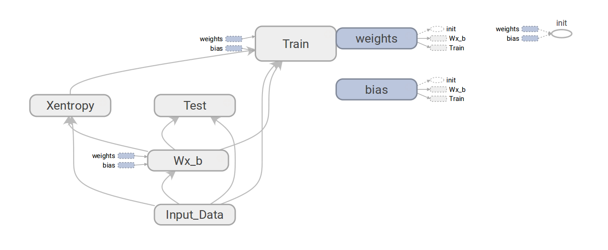
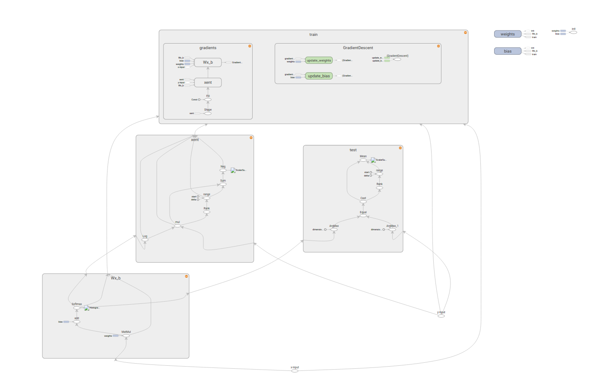
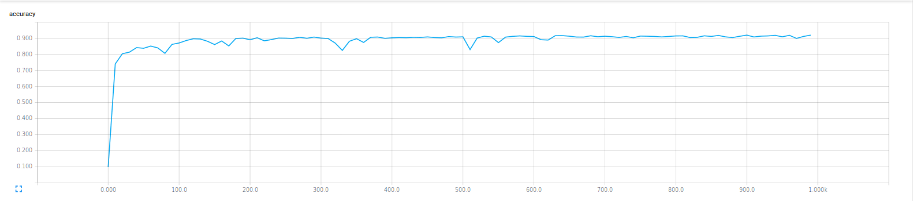
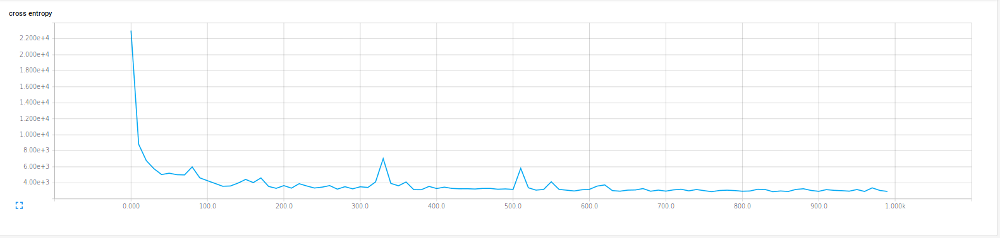
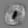
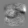
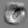
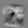

#MNIST handwritting recognition using TensorFlow

This repository is for the implementation of handwritting recogition with MNIST dataset using TensorFlow.

#Get Started

To run the programs please install TensorFlow with Python 2.7, using the instructions given [here](tensorflow/g3doc/get_started/os_setup.md)

For running basic softmax regression run the following command:
```bash
# Using default configuration for logs directory, batch size and number of iterations:
$ python softmaxReg.py

# For custom configuration use the following command:
$ python softmaxReg.py --max_it <no. of iterations> --batch <batch size> --log_dir <path to logs directory>

# For tensorboard visualization run following command and  visit http://locahost:6006:
$ tensorboard --logdir <path to logs directory>
```
#Data Flow Graphs

##Basic Softmax Implementation

###Overview Graph



###Expanded Graph



#Results

##Basic Softmax Implementation

Following results were obtained with batch size = 100 and number of iterations = 1000

###Accuracy



###Cross Entropy



###Weights Visualization

####0:




####1:


####2:


####3:


####4:


####5:




####6:




####7:




####8:


####9:


